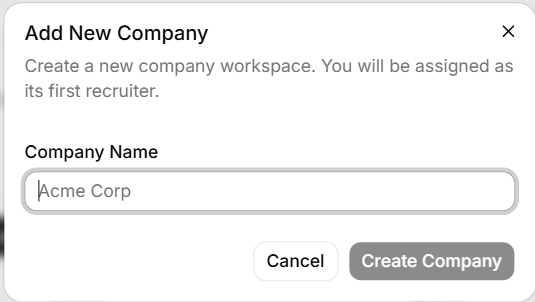
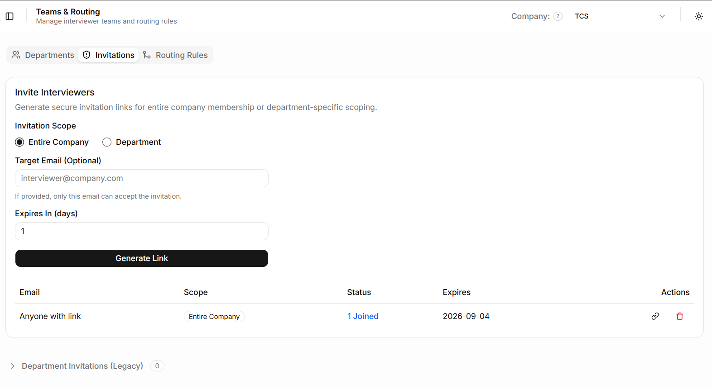
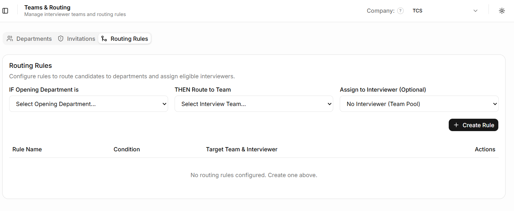

# Submission

## Links

- **GitHub repository:** <a href="https://github.com/iiioooiso/RosterPoint" target="_blank">https://github.com/iiioooiso/RosterPoint</a>
- **Live application:** <a href="https://hire.communx.org/" target="_blank">https://hire.communx.org/</a>
- **Vercel deployment:** <a href="https://roster-point.vercel.app/" target="_blank">https://roster-point.vercel.app/</a>

## Notes for the reviewer

- **Quick Logins:** No need to manually copy and paste credentials — quick-access buttons for Student, Recruiter, and Interviewer roles are provided directly on the sign-in interface.

> [!NOTE]
> **Database Migrations (`supabase/migrations/*`)**  
> SQL migration files are intentionally excluded from this public repository for deployment security and exposure considerations. Complete schema migration scripts are available and can be provided immediately upon request or via any private channel for technical evaluation. This omission does not affect reviewing the project's implementation, architecture, or functionality.

## Demo credentials

| Role | Email | Password |
|------|-------|----------|
| Student | student@gmail.com | Demo@12345 |
| Recruiter | recruiter@gmail.com | Demo@12345 |
| Interviewer | interviewer@gmail.com | Demo@12345 |

## Stack

| Layer | What you used | Why |
|-------|---------------|-----|
| Frontend | Next.js, React, Tailwind CSS, shadcn/ui | Fast development, robust component ecosystem, modern styling |
| Backend | Next.js Server Actions / APIs | Seamless integration with frontend, native type safety |
| Database | Supabase (PostgreSQL) | Built-in Auth, Row Level Security, easy relational modeling |
| Hosting | Vercel | Zero-configuration deployment, excellent edge performance |

## Goal checklist

Mark each honestly. Partial is fine — say what is partial.

| # | Goal | Status | Notes |
|---|------|--------|-------|
| 1 | Accounts and roles | Done | |
| 2 | Job openings | Done | |
| 3 | Applications inside job openings | Done | |
| 4 | A pipeline with rules | Done | |
| 5 | Interview panel | Done | |
| 6 | Finding candidates | Done | |
| 7 | Acting on many candidates at once | Done | |
| 8 | A dashboard | Done | |
| 9 | History you cannot rewrite | Done | |
| 10 | Stalled-application alerts | Done | |

## Additional Features Completed
- **A public careers page listing open positions:** <a href="https://hire.communx.org/careers" target="_blank">https://hire.communx.org/careers</a> 
- **A candidate-facing status portal** : https://hire.communx.org/student/dashboard
- **Resume tagging/uploading**
- **An email digest of stalled candidates**: Using Resend https://resend.com/
- **Offer letter generation**
- **Scalable Multi-Tenant Architecture**: Engineered with secure data partitioning to seamlessly support and manage multiple distinct companies within a unified platform.
   
  
- **Invites (mail and direct link) for interviewers**: 
   
  
   *(Reference: [https://hire.communx.org/recruiter/teams?tab=invitations](https://hire.communx.org/recruiter/teams?tab=invitations))*
- **Routing tab for automated routing of applicants**: 
   
  
   *(Reference: [https://hire.communx.org/recruiter/teams?tab=routing](https://hire.communx.org/recruiter/teams?tab=routing))*

### How much time did you actually spend?

Daily around 2-3hr

### What would you do next, with another 12 hours?

Robust Testing

### What are you least happy with in this codebase, and why?

NA
